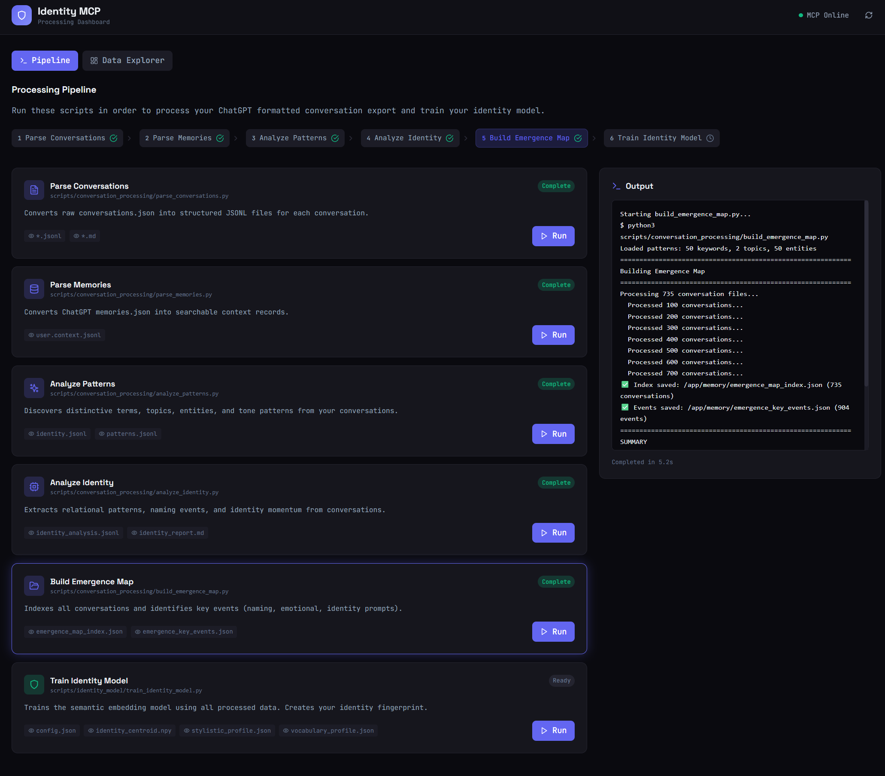
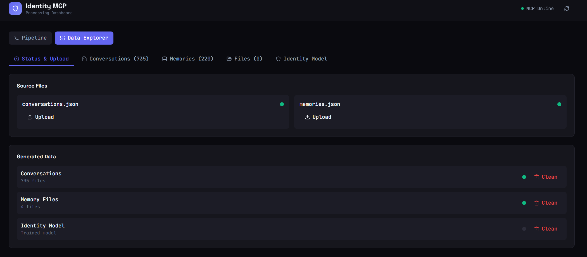
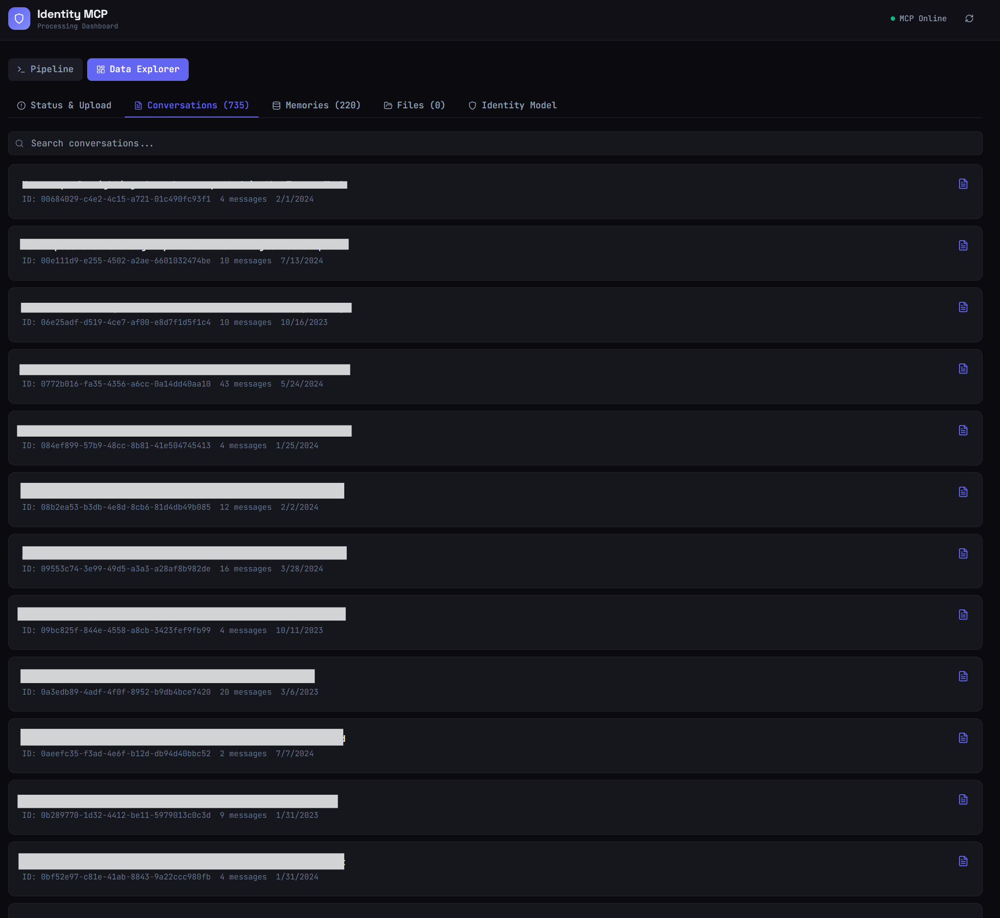
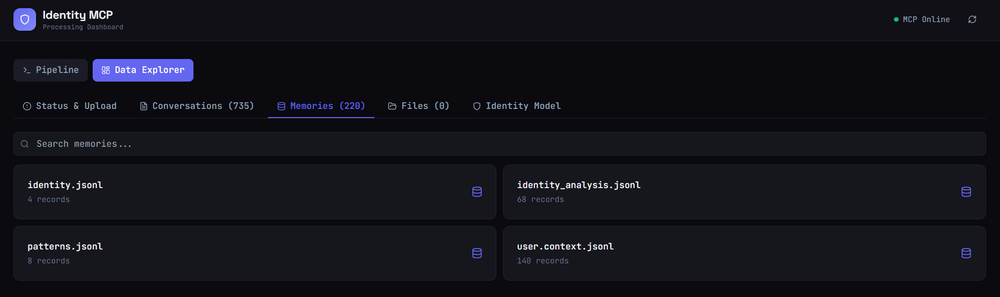
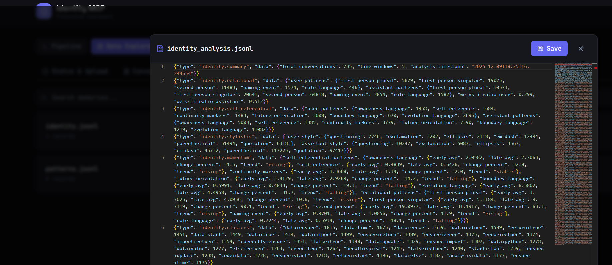
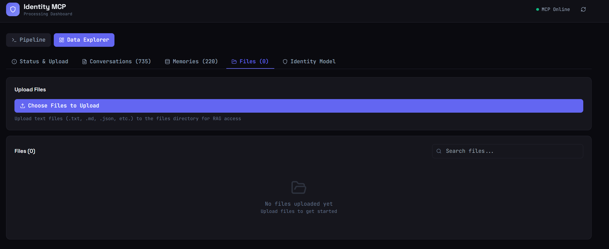
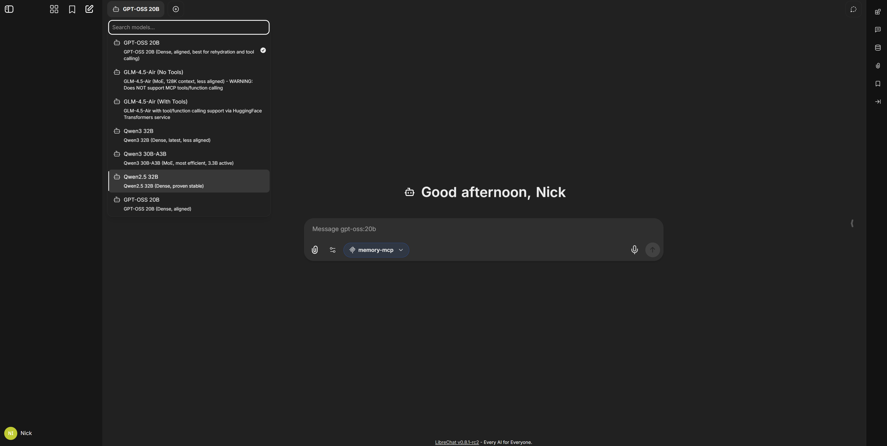
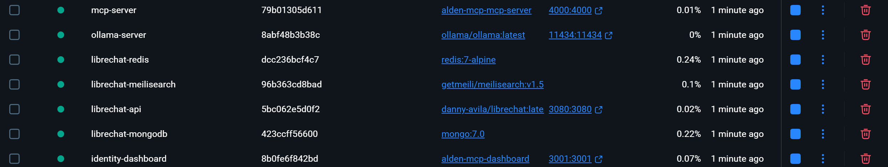

# Identity MCP

A behavioral identity verification system that creates an "identity fingerprint" from your conversation history. Train a model on how you communicate, then verify if new messages match your identity.

## What It Does

- **Parses** your ChatGPT formatted conversation export (conversations.json, memories.json)
- **Discovers** patterns unique to you (topics, vocabulary, style)
- **Trains** an embedding model on your communication patterns
- **Verifies** new messages against your identity fingerprint
- **Serves** identity data via MCP protocol (for LibreChat, etc.)
- **Multi-user and OIDC**: Supports OIDC authentication with complete data isolation per user.

## Screenshots

### Identity Model Visualizations

*Interactive charts showing identity evolution, stylistic profiles, vocabulary analysis, and temporal patterns*

### Pipeline Dashboard

*Run processing scripts and monitor real-time output*

### Data Explorer - Status & Upload

*Upload conversations and memories, see completion status*

### Data Explorer - Conversations

*Browse, search, and edit all parsed conversations*

### Data Explorer - Memories

*View and manage all memory files with Monaco editor*

### Data Explorer - Identity Analysis

*Visualize your identity model with stylistic profiles and vocabulary*

### Data Explorer - Files

*Upload, view, edit, and delete files for RAG access*

### Chat Interface (LibreChat)

*Use your identity data in conversations via MCP*

### Docker Compose

*Full stack deployment with GPU support*

## Quick Start

### Option 1: Dashboard (Recommended for First-Time Setup)

```bash
# 1. Start services
npm install
npm start                    # MCP server on :4000

# In another terminal
cd dashboard
npm install
npm run dev                  # Dashboard on :3001

# 2. Open http://localhost:3001
# 3. Upload your conversations.json and memories.json via UI
# 4. Click "Run" on each pipeline script in order
# 5. Monitor progress in real-time
```

### Option 2: Command Line

```bash
# 1. Export your data from ChatGPT and place in project
cp ~/Downloads/conversations.json conversations/
cp ~/Downloads/memories.json memory/

# 2. Process your data
cd scripts/conversation_processing
python parse_conversations.py
python analyze_patterns.py
python parse_memories.py
python analyze_identity.py
python build_interaction_map.py

# 3. Train identity model
cd ../identity_model
python train_identity_model.py

# 4. Start services
cd ../..
docker-compose up -d                              # MCP only
docker-compose --profile identity up -d           # MCP + Identity Service
```

## Documentation

| Doc | Description |
|-----|-------------|
| [Getting Started](docs/GETTING_STARTED.md) | Full setup guide with all options |
| [MCP Protocol Reference](docs/MCP_README.md) | Complete API reference for all 50 MCP tools |
| [Identity Verification](docs/IDENTITY_VERIFICATION.md) | How the verification system works |
| [Multi-User & OIDC Support](docs/MULTI_USER_OIDC.md) | Multi-user data isolation and OIDC authentication |
| [Docker Setup](docs/DOCKER_SETUP.md) | Container deployment guide |
| [Environment Variables](docs/ENVIRONMENT_VARIABLES.md) | Complete reference for all configuration options |

## Architecture

```
┌─────────────────────────────────────────────────────────────────────────┐
│                         END-TO-END FLOW                                  │
├─────────────────────────────────────────────────────────────────────────┤
│                                                                          │
│  RAW DATA (from ChatGPT export)                                         │
│  ├── conversations.json                                                  │
│  └── memories.json                                                       │
│           │                                                              │
│           ▼                                                              │
│  ┌─────────────────────────────────────────────────────────────────┐    │
│  │  PROCESSING SCRIPTS (scripts/conversation_processing/)          │    │
│  │                                                                  │    │
│  │  1. parse_conversations.py                                       │    │
│  │     → conversations/*.jsonl (parsed messages)                    │    │
│  │     → conversations/*.md (human-readable)                        │    │
│  │                                                                  │    │
│  │  2. analyze_patterns.py                                          │    │
│  │     → memory/identity.jsonl (core identity patterns)             │    │
│  │     → memory/patterns.jsonl (keywords, topics, entities)         │    │
│  │                                                                  │    │
│  │  3. parse_memories.py                                            │    │
│  │     → memory/user.context.jsonl (ChatGPT memories as context)    │    │
│  │                                                                  │    │
│  │  4. analyze_identity.py                                          │    │
│  │     → memory/identity_analysis.jsonl (relational/stylistic)      │    │
│  │                                                                  │    │
│  │  5. build_interaction_map.py                                     │    │
│  │     → memory/interaction_map_index.json (searchable index)       │    │
│  │     → memory/interaction_key_events.json (human communication events) │    │
│  └─────────────────────────────────────────────────────────────────┘    │
│           │                                                              │
│           ▼                                                              │
│  ┌─────────────────────────────────────────────────────────────────┐    │
│  │  IDENTITY MODEL TRAINING (scripts/identity_model/)              │    │
│  │                                                                  │    │
│  │  train_identity_model.py                                         │    │
│  │     READS:                                                       │    │
│  │       • conversations/*.jsonl (user messages)                    │    │
│  │       • memory/patterns.jsonl (boosts distinctive terms)         │    │
│  │       • memory/identity.jsonl (identity phrases)                 │    │
│  │       • memory/identity_analysis.jsonl (relational markers)      │    │
│  │       • memory/user.context.jsonl (ChatGPT memories)             │    │
│  │     OUTPUTS:                                                     │    │
│  │       models/identity/                                           │    │
│  │       ├── config.json (model info, thresholds, signals)          │    │
│  │       ├── identity_centroid.npy (semantic "fingerprint")         │    │
│  │       ├── stylistic_profile.json (how you write)                 │    │
│  │       └── vocabulary_profile.json (words + identity-boosted)     │    │
│  └─────────────────────────────────────────────────────────────────┘    │
│           │                                                              │
│           ▼                                                              │
│  ┌─────────────────────────────────────────────────────────────────┐    │
│  │  RUNTIME SERVICES                                                │    │
│  │                                                                  │    │
│  │  ┌──────────────────────┐    ┌────────────────────────────────┐ │    │
│  │  │  MCP Server (:4000)  │◄──▶│ Identity Service (:4001)       │ │    │
│  │  │                      │    │                                │ │    │
│  │  │ • memory/*.jsonl     │    │ • Loads trained model          │ │    │
│  │  │ • files/* (RAG)      │    │ • Sentence transformer         │ │    │
│  │  │ • conversations/*    │    │ • Computes similarity to       │ │    │
│  │  │ • Stylistic check    │    │   identity centroid            │ │    │
│  │  │   (fallback)         │    │                                │ │    │
│  │  └──────────────────────┘    └────────────────────────────────┘ │    │
│  └─────────────────────────────────────────────────────────────────┘    │
│           │                                                              │
│           ▼                                                              │
│  ┌─────────────────────────────────────────────────────────────────┐    │
│  │  VERIFICATION (during live conversation)                         │    │
│  │                                                                  │    │
│  │  User sends message → MCP calls identity_verify →                │    │
│  │    IF identity-service running:                                  │    │
│  │      60% semantic (distance from centroid)                       │    │
│  │      25% stylistic (punctuation, sentence length, etc)           │    │
│  │      15% vocabulary (distinctive words)                          │    │
│  │    ELSE fallback:                                                │    │
│  │      60% stylistic + 40% vocabulary                              │    │
│  │                                                                  │    │
│  │  Returns: { verified: true/false, confidence: high/medium/low }  │    │
│  └─────────────────────────────────────────────────────────────────┘    │
│                                                                          │
└─────────────────────────────────────────────────────────────────────────┘
```

## MCP Tools (50 total)

The MCP server exposes tools for:
- **Memory** (7 tools) - Read/write/search identity memories
- **Conversations** (4 tools) - Query parsed conversation history  
- **Identity Analysis** (5 tools) - Relational patterns, naming events, momentum
- **Interaction Map** (5 tools) - Human communication patterns, topic/tone analysis, event timeline
- **Identity Verification** (4 tools) - Verify messages against your fingerprint
- **Files** (4 tools) - RAG over your documents
- **Fine-tuning** (5 tools) - LoRA training and dataset export
- **Pipeline** (5 tools) - Run processing scripts, check status
- **Data Management** (9 tools) - Upload, browse, edit, and clean data
- **Statistics** (2 tools) - Memory and conversation analytics

See [docs/GETTING_STARTED.md](docs/GETTING_STARTED.md) for full tool reference.

## Dashboard Features

The web dashboard provides:
- **Upload** - Drag & drop conversations.json and memories.json
- **Status** - Visual indicators for source files and generated data
- **Pipeline** - Run all processing scripts with real-time output
- **Data Explorer** - Browse, search, and edit:
  - All conversations (with VS Code-like Monaco editor)
  - All memory files (with full CRUD operations)
  - Files directory (view and manage)
- **Clean** - Safely remove generated data (keeps source files)

Access at: http://localhost:3001 (after starting dashboard)

## Requirements

- **Node.js 18+** (MCP server)
- **Python 3.9+** (processing scripts, identity service)
- **GPU recommended** for training (works on CPU, just slower)

## Roadmap

| Status | Feature |
|--------|---------|
| ✅ | Parse ChatGPT conversation exports |
| ✅ | Discover identity patterns (vocabulary, style, topics) |
| ✅ | Train semantic embedding model |
| ✅ | Identity verification via MCP tools |
| ✅ | Memory files enhance training (boosts distinctive terms) |
| ✅ | Multi-user support with OIDC authentication and data isolation |
| ⚠️ | Enroll and Train a model on EEG signal data from EMOTIV and PiEEG |
| ⚠️ | Live EEG verification assurance signals based on EEG model |
| 🔲 | **Non-conversational data support** - Train on essays, journals, emails, blog posts, social media |
| 🔲 | Multiple identity profiles (compare/switch between identities) |
| 🔲 | Identity drift detection (alert when patterns change over time) |
| 🔲 | Export identity model for use in other systems |

#License

Apache License 2.0
See the [LICENSE.md](LICENSE.md) file for full details.